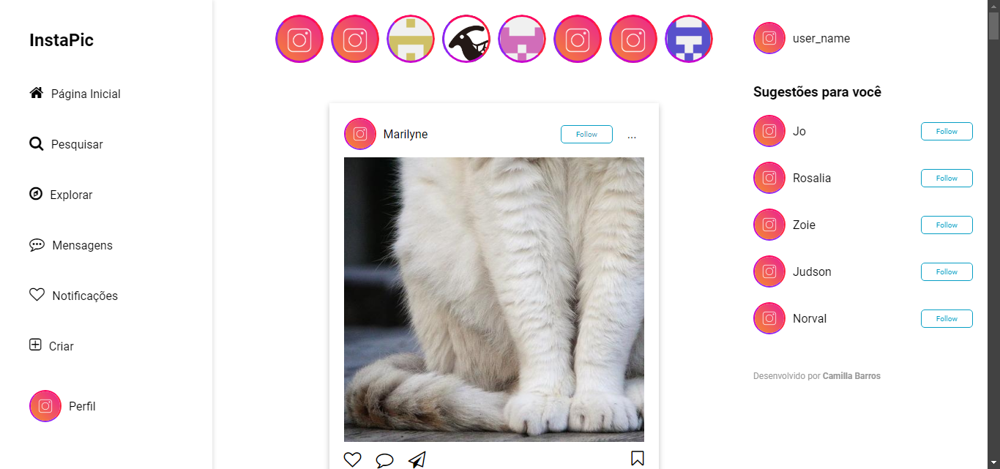

# InstaPic - um clone dos posts do instagram



Este projeto foi desenvolvido em sala de aula na Formação Acelerada em Programação - FAP em Front-End da Softex Pernambuco. O projeto objetiva uma simulação de um feed de posts no estilo do Instagram, com funcionalidades como curtidas, salvamento de posts e a opção de seguir usuários. Tudo foi feito utilizando TypeScript, HTML e CSS.

## Dependências do projeto

Este projeto utilizou as seguintes bibliotecas:

- @faker-js/faker - Biblioteca para gerar dados fictícios.
- uuid - Biblioteca para gerar UUIDs únicos.
- @types/uuid - Tipos TypeScript para a biblioteca UUID.

### Dependências de desenvolvimento

- typescript: Transpilador TypeScript para JavaScript.
- vite: Bundler e servidor de desenvolvimento.

## Instalação

Para instalar as dependência do projeto (bibliotecas e dependências de desenvolvimento):

```bash
  npm install
```

## Para rodar o projeto

Como dev:

```bash
  npm run dev
```

# Meu processo

## O que aprendi?

Neste projeto pude aprimorar meus conhecimentos em Flexbox, position, animation e transition. No que se refere a typescript e JavaScript, pude implementar funcionalidades dinâmicas para o site.

## O que precisa melhorar?

O projeto ainda necessita do desenvolvimento de partes como o perfil, mensagens, notificações, além da adaptação responsiva de todo o conteúdo.

## Quem desenvolveu?

Entre em contato comigo:

- LinkedIn - [Camilla Barros](https://www.linkedin.com/in/camillabarros/)
